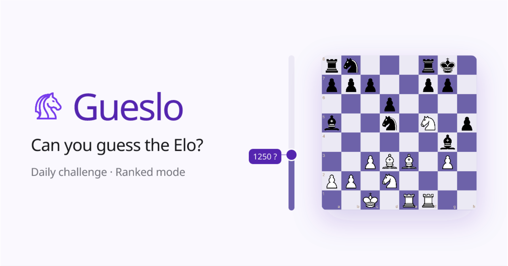

# Gueslo

**Guess the Elo of real chess games — daily challenge and ranked mode.**

[](https://gueslo.app)



---

## What is it?

You're shown a real chess game with player names and ratings hidden. Navigate through the moves, then guess the average Elo of the two players. Score is 0–5,000 based on accuracy — within 20 points is a perfect score, then exponential decay.

## Modes

- **Daily Challenge** — one game per day, same for everyone worldwide, no account required, shareable Wordle-style results
- **Ranked Mode** — 5-round sessions that affect your personal Elo rating, requires account

## Tech Stack

- [Next.js 16](https://nextjs.org) — App Router, Server Components, Server Actions
- [TypeScript](https://www.typescriptlang.org) — strict mode
- [Tailwind CSS](https://tailwindcss.com) + [shadcn/ui](https://ui.shadcn.com)
- [Supabase](https://supabase.com) — auth, PostgreSQL, RLS
- [chess.js](https://github.com/jhlywa/chess.js) + [react-chessboard](https://github.com/Clariity/react-chessboard) — game parsing and board rendering
- Games sourced from the [Lichess open database](https://database.lichess.org)

## Development

```bash
npm run dev       # start dev server
npm run build     # production build
npm run cleanup   # type-check + lint + format
```

```bash
npx supabase db push                                                                 # apply migrations
npx supabase gen types typescript --project-id <id> > lib/database.types.ts         # regenerate types
```
